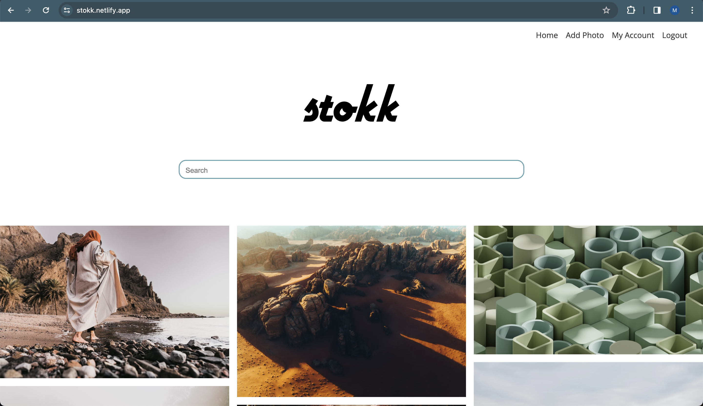

# Stokk - Stock Image Library

## Project Description

Stokk is a stock image library that allows you to explore and discover new images available for download. All images provided by Stokk are free of rights, making it a valuable resource for various creative projects.

## Tech Stack

This full-stack application was built using the MERN stack (MongoDB, Express.js, React.js, Node.js). It is partially integrated with the Unsplash API to enrich the collection of available images. The front-end of the application is developed with React.js, providing a seamless and interactive user experience. The back-end is accessible through the stokk-server repository.

## Features

### Responsive Design

Experience a fully responsive design, ensuring a seamless user interface across devices.

### Search Functionality

Utilize the search bar to easily discover high-quality images using specific keywords.

### Image Management

- **Add and Delete Photos:** Take control of your image library by adding new photos or removing ones that no longer fit your creative vision.
- **Modify Titles:** Personalize your experience by modifying titles for images. Add context or captions to enhance your collection.

### Favorites

- **Add/Remove Favorites:** Curate your favorite images by adding or removing them from your account. This feature allows you to create a personalized collection of go-to images for quick access.

- **Store and View Favorites:** Your favorite images are securely stored in your account, making it easy to revisit and explore them whenever you need inspiration.

## Demo

Feel free to engage with the platform, modify titles, manage your image collection, and create a personalized favorites list! The demo is accessible using the following link:

[Stokk Demo](https://stokk.netlify.app/ "Stokk Demo")
